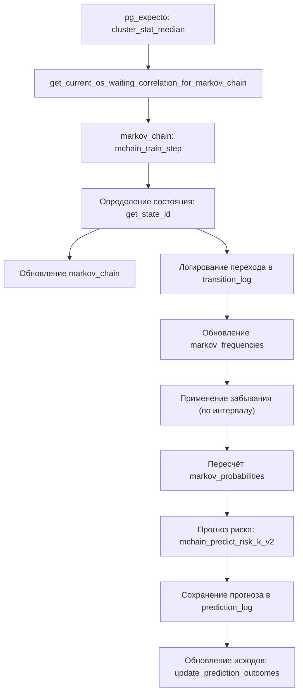

# Цепь Маркова для прогнозирования инцидентов производительности СУБД PostgreSQL в составе комплекса [pg_expecto](https://github.com/pg-expecto/pg_expecto)

[pg_expecto](https://github.com/pg-expecto/pg_expecto) — комплекс статистического анализа производительности СУБД PostgreSQL. 
Данный репозиторий содержит реализацию цепи Маркова для прогнозирования риска возникновения инцидентов производительности на основе наблюдаемых метрик.

# Механизм интеграции pg_expecto и markov_chain

## 1. Общая архитектура

Проект **pg_expecto** представляет собой систему мониторинга производительности PostgreSQL, которая собирает и агрегирует метрики на уровне кластера, отдельных SQL-запросов и операционной системы. Проект **markov_chain** реализует цепь Маркова для прогнозирования риска возникновения инцидентов производительности (аварийных состояний) на основе трендов операционной скорости и времени ожиданий.

Интеграция построена по принципу **поставщик-потребитель**: pg_expecto выступает в роли поставщика текущих метрик (корреляция, тренды), а markov_chain использует эти метрики для построения и обучения вероятностной модели, которая затем выдаёт прогнозы риска на заданный горизонт.

---

## 2. Ключевые компоненты интеграции

### 2.1. pg_expecto – источник данных для цепи Маркова

- **Таблица `cluster_stat_median`**  
  Содержит скользящие медианы ключевых метрик за последний час:
  - `curr_op_speed` – операционная скорость (сумма медиан числа вызовов и строк)
  - `curr_waitings` – общее количество ожиданий (сумма медиан по типам `BufferPin`, `IO`, `Lock` и др.)

- **Функция `get_current_os_waiting_correlation_for_markov_chain`**  
  Определена в `performance_metrics_for_markov_chain.sql` (входит в состав pg_expecto).  
  Вычисляет три значения на основе данных `cluster_stat_median` за последний час:
  - `current_correlation` – коэффициент корреляции между `curr_op_speed` и `curr_waitings` (округлённый до 0.1)
  - `current_os_trend` – знак угла наклона линии регрессии для `curr_op_speed` по времени (-1, 0, +1)
  - `current_wait_trend` – знак угла наклона линии регрессии для `curr_waitings` по времени (-1, 0, +1)

  Эта функция используется **markov_chain** для получения текущего состояния системы.

### 2.2. markov_chain – потребитель и модель прогнозирования

- **Функция `mchain_train_step`** – основной шаг обучения, вызываемый каждую минуту.  
  - Запрашивает текущие метрики через `get_current_os_waiting_correlation_for_markov_chain`.
  - Преобразует их в дискретное состояние (state_id) с помощью `get_state_id`.
  - Обновляет внутреннее состояние цепи (таблица `markov_chain`).
  - Логирует переход между предыдущим и текущим состояниями в `transition_log`.
  - Обновляет накопленные частоты переходов в `markov_frequencies`.
  - При необходимости (по таймеру) вызывает `mchain_apply_forgetting` для забывания старых данных и пересчёта вероятностей.

- **Справочник состояний `state_descriptions`**  
  Содержит все 189 возможных состояний, где каждое состояние кодирует комбинацию:
  - округлённая корреляция (от -1.0 до +1.0 с шагом 0.1)
  - тренд операционной скорости (-1, 0, +1)
  - тренд времени ожидания (-1, 0, +1)

- **Таблица `critical_states`** – динамический список аварийных состояний (correlation < 0, os_trend = -1, wait_trend = 1), которые считаются инцидентами. Обновляется автоматически функцией `refresh_critical_states` на основе эмпирических данных из таблицы `performance_incident` (также из pg_expecto).

- **Матрица вероятностей `markov_probabilities`** – условные вероятности перехода из одного состояния в другое, вычисленные из `markov_frequencies` с учётом забывания.

- **Функции прогноза**  
  - `mchain_predict_risk_k_v2(state_id, k)` – вероятность хотя бы одного попадания в критическое множество за k шагов (минут) с использованием динамического программирования.
  - `collect_prediction()` – вызывается внутри `mchain_train_step` для сохранения прогноза в `prediction_log` (горизонт берётся из `markov_config.forecast_horizon_minutes`).

---

## 3. Поток данных и синхронизация



**Ключевые шаги:**

1. **Сбор метрик** – pg_expecto по расписанию (например, каждую минуту) выполняет `cluster_stat_median()`, записывая данные в `cluster_stat_median`.
2. **Вызов обучения** – cron-задача или pgAgent запускает `mchain_train_step()` каждую минуту.
3. **Получение текущего состояния** – `mchain_train_step` вызывает `get_current_os_waiting_correlation_for_markov_chain`, которая опирается на последние 60 минут данных из `cluster_stat_median`.
4. **Обновление цепи** – фиксируется переход между состояниями, частота инкрементируется.
5. **Забывание** – если прошло достаточно времени с последнего забывания (`interval_minute`), применяется адаптивный коэффициент `alpha` и частоты умножаются на `(1 - alpha)`, после чего пересчитываются вероятности.
6. **Прогнозирование** – `collect_prediction()` вычисляет риск на горизонт из `markov_config.forecast_horizon_minutes` и сохраняет его в `prediction_log`.
7. **Оценка качества** – функция `update_prediction_outcomes()` обновляет фактические исходы (был ли инцидент в течение горизонта) и позволяет рассчитывать метрики качества (Brier, ROC-AUC).

---

## 4. Взаимодействие через конфигурацию

Интеграция управляется через таблицу `markov_config`, которая содержит параметры обучения и забывания, а также **единый горизонт прогноза** (`forecast_horizon_minutes`), используемый и для обучения, и для отчётов.

Пример настройки:
```sql
UPDATE markov_config SET
    forecast_horizon_minutes = 30,
    adaptive_forgetting_enabled = true,
    use_adaptive_alpha = true,
    base_alpha = 0.1,
    min_alpha = 0.01,
    incident_half_life_days = 7,
    interval_minute = 180,
    min_transitions_for_forgetting = 5000;
```

---

## 5. Автоматизация (cron-задачи)

В файле `markov_chain_functions.sql` приведены примеры cron-записей, обеспечивающих непрерывную работу интеграции:

| Задача | Периодичность | Команда |
|--------|---------------|---------|
| Обучение цепи | каждую минуту | `SELECT mchain_train_step();` |
| Обновление исходов прогнозов | каждые 5 минут | `SELECT update_prediction_outcomes();` |
| Расчёт суточных метрик качества | ежедневно в 02:00 | `SELECT calculate_daily_quality_metrics(CURRENT_DATE - 1, 30);` |
| Очистка старых переходов | ежедневно в 01:15 | `SELECT mchain_clean_transition_log();` |
| Обновление критических состояний | еженедельно (воскресенье) | `SELECT refresh_critical_states();` |
| Оптимизация параметров забывания | еженедельно | `CALL optimize_forgetting_params(...);` |

---

## 6. Расширяемость и независимость

Интеграция спроектирована так, чтобы **pg_expecto** оставался универсальным источником метрик, а **markov_chain** мог работать с любым поставщиком, предоставляющим аналогичный интерфейс. Единственная точка зависимости – функция `get_current_os_waiting_correlation_for_markov_chain`, которая возвращает три значения. Это позволяет заменить pg_expecto на другой источник данных, если он будет соответствовать этому контракту.

Все таблицы и функции markov_chain используют только этот интерфейс, что делает интеграцию слабо связанной и легко тестируемой.

---

## 7. Заключение

Интеграция pg_expecto и markov_chain представляет собой **замкнутый цикл мониторинга и прогнозирования**:

- pg_expecto собирает и агрегирует низкоуровневые метрики СУБД и ОС.
- markov_chain преобразует эти метрики в дискретные состояния, строит вероятностную модель переходов и выдаёт прогноз риска инцидента.
- Обратная связь (факт наступления инцидента) используется для обучения модели и оценки её качества, что позволяет адаптироваться к изменяющимся условиям работы системы.

Такая архитектура обеспечивает **автоматическое, самообучающееся прогнозирование** без вмешательства администратора, а также предоставляет прозрачные отчёты для анализа и настройки.

---

## Краткое описание реализации цепи Маркова (версия 10)

**Версия 10.1.6** — классическая реализация на основе стационарных состояний и жёстко заданных аварийных критериев.

**Ключевые детали:**

- **Состояния** – 189 комбинаций (корреляция 21 градация × тренд OS 3 × тренд wait 3). Фиксированный справочник `state_descriptions`.
- **Аварийные состояния** – жёстко заданы условием: `correlation < 0 AND os_trend = -1 AND wait_trend = 1`. Используются как поглощающие состояния.
- **Обучение** – пошаговое (`mchain_train_step`): получение метрик, логирование переходов, обновление частот (`markov_frequencies`), плановое забывание (`mchain_apply_forgetting`) с адаптивным `alpha`.
- **Прогноз риска** – на основе **поглощающей матрицы** (`markov_absorbing`), которая перестраивается при каждом обновлении вероятностей. Поддерживаются горизонты: 1 минута (одношаговый), `k` шагов (через `mchain_predict_risk_k`), а также обёртки на 15, 30 и 60 минут.
- **Достоверность прогнозов** – оценивается рейтингом 0–5 на основе объёма данных, стабильности вероятностей и покрытия частых состояний (`mchain_forecast_reliability`).
- **Отчёты** – используют жёсткое определение аварийных состояний (`mchain_incident_transitions_report`, `mchain_incident_state_detail_report`).

---

## Краткое описание реализации цепи Маркова (версия 11)

**Версия 11.3** — эволюционная версия с динамическим определением аварийных состояний, единым горизонтом прогноза и отказом от поглощающей матрицы в пользу итеративного расчёта.

**Ключевые детали:**

- **Состояния** – остались без изменений (189 комбинаций).
- **Аварийные состояния** – теперь **динамический список** в таблице `critical_states`. Обновляется автоматически через `refresh_critical_states` на основе эмпирического риска (функция `compute_empirical_incident_risk`), использующей таблицу `performance_incident`.
- **Горизонт прогноза** – задаётся в `markov_config.forecast_horizon_minutes` (по умолчанию 30 минут). Единый для всех прогнозов, сохраняется в `prediction_log.horizon_minutes`.
- **Прогноз риска** – заменён на `mchain_predict_risk_k_v2`, который **не использует поглощающую матрицу**. Вместо этого на каждом шаге итеративно умножается вектор распределения на матрицу `markov_probabilities`, а вероятности критических состояний накапливаются и обнуляются. Поглощающая матрица больше не перестраивается (`rebuild_markov_absorbing` отключена).
- **Прогнозирование** – унифицировано через `collect_prediction` (вызывается из `mchain_train_step`) и `update_prediction_outcomes`, работающие с единым горизонтом.
- **Достоверность прогнозов** – доработана: добавлены штрафы за нестабильность, изменена интерпретация рейтингов, расширены рекомендации.
- **Отчёты** (`mchain_summary_report`, `mchain_incident_transitions_report`, `mchain_incident_state_detail_report`) переведены на использование `critical_states` вместо жёсткого условия.
- **Качество прогнозов** – новый отчёт `mchain_quality_report`, учитывающий горизонт; суточные метрики (`calculate_daily_quality_metrics`) теперь сохраняют горизонт.

---

## Краткое описание реализации цепи Маркова (версия 12)

**Версия 12.1** — уточняющая версия, направленная на повышение надёжности оценки стабильности модели и достоверности прогнозов.

**Ключевые изменения относительно версии 11:**

- **Фильтрация при расчёте стабильности** – из вычисления `max_prob_change` (максимальное изменение вероятностей переходов) исключаются:
  - переходы в критические состояния (список `critical_states`),
  - состояния, имеющие менее 200 переходов за анализируемый период.
  
  Это позволяет избежать искажений, вызванных редкими событиями или аварийными состояниями, и даёт более точную оценку реальной стабильности модели.

- **Обновлены параметры конфигурации по умолчанию** в таблице `markov_config`:
  - `interval_minute` изменён с 180 на 60 (забывание применяется чаще),
  - `base_alpha` изменён с 0.1 на 0.07 (более мягкое забывание, снижающее резкие изменения).

- **Соответствующие изменения в функциях**:
  - `mchain_check_sufficiency` – добавлена фильтрация для вычисления `stability_factor`,
  - `mchain_forecast_reliability` – улучшена оценка стабильности,
  - `mchain_reliability_report` – в детализацию включена фильтрация,
  - `evaluate_forgetting_params` – при подборе параметров забывания учитывается фильтрация,
  - `report_stability_trend` – в отчёте о стабильности теперь также используется фильтрация.

Эти улучшения повышают точность оценки достоверности прогнозов и позволяют лучше адаптировать параметры забывания к реальному поведению системы, уменьшая влияние шумовых данных.

---

## Сравнительная таблица версий 10, 11 и 12

| Аспект | Версия 10 | Версия 11 | Версия 12 |
|--------|-----------|-----------|-----------|
| **Определение аварийных состояний** | Жёсткое условие: `correlation<0 AND os_trend=-1 AND wait_trend=1` | Динамический список `critical_states`, обновляемый по эмпирическим данным | То же, что в версии 11 |
| **Прогноз риска** | Через поглощающую матрицу (`markov_absorbing`) | Итеративное обнуление вероятностей в критических состояниях (`mchain_predict_risk_k_v2`) | То же, что в версии 11 |
| **Горизонт прогноза** | Фиксированные обёртки (1, 15, 30, 60 мин) | Единый горизонт из `markov_config.forecast_horizon_minutes` | То же, что в версии 11 |
| **Поглощающая матрица** | Перестраивается при каждом обновлении вероятностей | **Не используется** (функция отключена) | Не используется |
| **Журнал прогнозов** | Хранит только риск и ситуацию | Добавлено поле `horizon_minutes` | То же, что в версии 11 |
| **Обновление critical_states** | Отсутствует | `refresh_critical_states` с аудитом (`critical_states_audit`) | То же, что в версии 11 |
| **Эмпирический риск** | Не вычисляется | Функция `compute_empirical_incident_risk` на основе `performance_incident` | То же, что в версии 11 |
| **Достоверность прогнозов** | Рейтинг 0–5 без штрафов за нестабильность | Добавлены штрафы за высокую нестабильность, интерпретация расширена | **Улучшена фильтрация**: исключены критические и редкие состояния из расчёта стабильности |
| **Отчёты** | Используют жёсткое условие | Используют `critical_states` | Используют `critical_states` |
| **Отчёт о качестве** | Отсутствовал | Добавлен `mchain_quality_report` с учётом горизонта | То же, что в версии 11 |
| **Суточные метрики** | Без учёта горизонта | Сохраняют горизонт в `notes` и используют его для фильтрации прогнозов | То же, что в версии 11 (добавлена обработка конфликтов) |
| **Расчёт стабильности** | Без фильтрации | Без фильтрации | **Исключены переходы в критические состояния и состояния с <200 переходов** |
| **Параметры по умолчанию** | `interval_minute=180`, `base_alpha=0.1` | `interval_minute=180`, `base_alpha=0.1` | `interval_minute=60`, `base_alpha=0.07` |

**Вывод:** Версия 12 представляет собой эволюционное улучшение версии 11, направленное на повышение точности и надёжности оценки стабильности модели путём фильтрации шумовых данных, а также настройку параметров забывания для более быстрой адаптации к изменениям. Это делает прогнозы более устойчивыми и достоверными в реальных условиях эксплуатации.

---

## Использование

Дополнительные материалы :  [Цепи Маркова](https://dzen.ru/suite/1f4b9884-5059-4b1d-a70b-182b0a286b32)

## Контакты

- Ринат Сунгатуллин: **kznalp@yandex.ru**
- [Дзен-канал](https://dzen.ru/kznalp) : https://dzen.ru/kznalp
- [Max](https://max.ru/join/T8sCiETC85Tr4Dkh_nM362PVcCbGDLagF4RZKHf4Udg)

## Статус проекта

Текущая версия: 12.2


