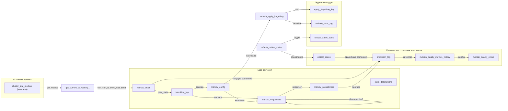

# Цепь Маркова для прогнозирования аварийных ситуаций

[](https://www.postgresql.org/)
[](https://github.com/your-repo/markov-chain)
[](https://www.apache.org/licenses/LICENSE-2.0)

**Реализация цепи Маркова с онлайн‑обучением** для прогнозирования инцидентов (аварий) на основе трёх потоковых метрик производительности:  
`корреляция`, `тренд операционной скорости`, `тренд времени ожидания`.

Модель обучается каждую минуту, адаптивно забывает устаревшие паттерны и выдаёт прогноз риска на 15, 30 и 60 минут с использованием итеративного умножения вектора распределения на матрицу вероятностей. Аварийные состояния определяются динамически на основе эмпирического риска и хранятся в таблице `critical_states`.

---

## Содержание

- [Общее описание](#общее-описание)
- [Основные возможности](#основные-возможности)
- [Архитектура](#архитектура)
  - [Граф вызовов функций](#граф-вызовов-функций)
  - [Граф взаимодействия таблиц](#граф-взаимодействия-таблиц)
- [Кодирование состояний](#кодирование-состояний)
- [Конфигурация](#конфигурация)
- [Ключевые функции](#ключевые-функции)
  - [mchain_train_step – Минутное обучение](#mchain_train_step--минутное-обучение)
  - [Механизм обучения цепи Маркова](#механизм-обучения-цепи-маркова)
  - [Адаптивное забывание](#адаптивное-забывание)
  - [Управление забыванием](#управление-забыванием)
  - [Динамическое обновление критических состояний](#динамическое-обновление-критических-состояний)
- [Прогнозирование риска](#прогнозирование-риска)
- [Оценка качества прогнозов](#оценка-качества-прогнозов)
- [Обслуживание (Cron)](#обслуживание-cron)
- [Мониторинг и диагностика](#мониторинг-и-диагностика)
- [Лицензия](#лицензия)

---

## Общее описание

Данная реализация цепи Маркова предназначена для **прогнозирования аварийного состояния** (инцидента) системы на основе трёх потоковых метрик:

- **Текущая корреляция** между операционной скоростью и временем ожидания (`correlation`).
- **Тренд операционной скорости** (`os_trend`): −1 (падение), 0 (стабильно), +1 (рост).
- **Тренд времени ожидания** (`wait_trend`): −1, 0, +1.

Комбинация (округлённая корреляция с шагом 0.1 + два тренда) образует **189 дискретных состояний** (от −1.0 до +1.0). Справочник `state_descriptions` заполняется один раз функцией `fill_state_descriptions()`.

Модель работает в **режиме онлайн‑обучения**:

- Каждую минуту корневая функция `mchain_train_step()` вызывается из процедуры сбора метрик `performance_metrics`.
- Она получает свежие метрики из таблицы `cluster_stat_median` (через вспомогательную функцию `get_current_os_waiting_correlation_for_markov_chain`), определяет текущее состояние и логирует переход `(предыдущее → текущее)`.
- Частоты переходов накапливаются в таблице `markov_frequencies`.
- Периодически (по расписанию или при превышении порога) применяется **адаптивное забывание**, чтобы модель отслеживала дрейф поведения системы.
- По текущей матрице вероятностей строятся **прогнозы риска** на 15, 30 и 60 минут с использованием итеративного умножения вектора распределения, при этом вероятности критических состояний (из `critical_states`) на каждом шаге суммируются в риск и обнуляются, чтобы избежать двойного учёта.
- **Триггер `trigger_update_incident_time`** автоматически обновляет `markov_config.last_incident_time` при каждом переходе в состояние, входящее в `critical_states`. Это обеспечивает динамическую настройку коэффициента забывания.

Средняя частота реальных инцидентов (аварийных переходов) составляет **≈1 событие в день**, что учитывается при динамическом расчёте коэффициента забывания.

---

## Основные возможности

- **Онлайн‑обучение** – одно новое наблюдение в минуту, без периодического переобучения.
- **Адаптивное забывание** – коэффициент забывания `α` зависит от времени, прошедшего с последнего инцидента (экспоненциальное затухание с настраиваемым периодом полураспада).
- **Динамические критические состояния** – список аварийных состояний пересчитывается автоматически (например, еженедельно) на основе эмпирического риска за последние 60 дней (функция `refresh_critical_states`).
- **Прогноз риска с исключением повторного учёта** – итеративное умножение вектора на матрицу вероятностей с обнулением вероятностей критических состояний на каждом шаге даёт корректную оценку вероятности хотя бы одного инцидента за горизонт.
- **Сбор и оценка прогнозов** – прогнозы сохраняются в `prediction_log`, их исходы обновляются по истечении горизонта; суточные метрики качества (Brier, log‑loss, ROC‑AUC, калибровка) вычисляются и сохраняются в историю.
- **Полное журналирование** – логи ошибок, вызовов забывания, аудит изменений критических состояний.
- **Диагностика и отчёты** – готовые отчёты о достоверности, качестве прогнозов, матрице переходов между макрогруппами и сводный health‑check.

---

## Архитектура

### Граф вызовов функций

```mermaid
flowchart TD
    A[mchain_train_step] --> B[get_current_os_waiting_correlation_for_markov_chain]
    A --> C[get_state_id]
    A --> D[mchain_log_transition]
    A --> E{По истечении interval_minute?}
    E -->|Да| F[mchain_apply_forgetting]

    D --> G["INSERT INTO transition_log"]
    D --> H["UPDATE markov_frequencies"]

    F --> I[mchain_check_sufficiency]
    F --> J["UPDATE markov_frequencies SET frequency = frequency * (1-alpha)"]
    F --> K["DELETE FROM markov_frequencies WHERE frequency < 1e-6"]
    F --> L[update_markov_probabilities]
    F --> M["UPDATE markov_config SET last_forget_time"]
    F --> N["INSERT INTO apply_forgetting_log"]

    L --> O["TRUNCATE markov_probabilities"]
    L --> P["INSERT INTO markov_probabilities FROM markov_frequencies"]

    subgraph "Триггер"
        U["trigger_update_incident_time<br>AFTER INSERT ON transition_log"] --> V["UPDATE markov_config<br>SET last_incident_time<br>IF to_state IN critical_states"]
    end

    subgraph "Прогнозы (v2)"
        W[mchain_predict_risk_15min_v2] --> X[mchain_predict_risk_k_v2]
        Y[mchain_predict_risk_30min_v2] --> X
        Z[mchain_predict_risk_1hour_v2] --> X
        X --> markov_probabilities[markov_probabilities]
        X --> critical_states[critical_states]
    end

    subgraph "Сбор прогнозов и качество"
        AA[collect_prediction] --> prediction_log[prediction_log]
        AB[update_prediction_outcomes] --> prediction_log[prediction_log]
        AC[calculate_daily_quality_metrics] --> mchain_quality_metrics_history[mchain_quality_metrics_history]
    end

    subgraph "Обновление критических состояний"
        AD[refresh_critical_states] --> critical_states[critical_states]
        AD --> critical_states_audit[critical_states_audit]
        AD --> compute_empirical_incident_risk[compute_empirical_incident_risk]
    end

    subgraph "Cron / обслуживание"
        AE[mchain_clean_transition_log] --> transition_log[transition_log]
        AF[mchain_clean_apply_forgetting_log] --> apply_forgetting_log[apply_forgetting_log]
        AG[refresh_critical_states] --> critical_states[critical_states]
        AH[update_prediction_outcomes] --> prediction_log[prediction_log]
        AI[calculate_daily_quality_metrics] --> mchain_quality_metrics_history[mchain_quality_metrics_history]
    end
```



**Примечания:**

- `mchain_train_step` – единственная функция, запускаемая **каждую минуту** из `performance_metrics`.
- Адаптивное забывание инициируется **только** из `mchain_train_step` при достижении `interval_minute` и если `adaptive_forgetting_enabled = true`.
- Прогнозные функции (`mchain_predict_risk_*_v2`) используют `markov_probabilities` и `critical_states`, они не влияют на обучение.
- Триггер `trigger_update_incident_time` обновляет `last_incident_time` при любом переходе в состояние из `critical_states`.

### Граф взаимодействия таблиц



**Основные потоки:**

1. **Обучение** (минутное): `cluster_stat_median` → `get_current_os_waiting...` → `markov_chain` → `transition_log` → `markov_frequencies`.
2. **Пересчёт вероятностей** (при забывании): `markov_frequencies` → `markov_probabilities`.
3. **Адаптивное забывание**: читает `markov_config`, обновляет `markov_frequencies`, логирует в `apply_forgetting_log`.
4. **Прогнозирование риска**: читает `markov_probabilities`, `critical_states` и текущее состояние (из `markov_chain` или через `get_current_os_waiting...`), сохраняет прогнозы в `prediction_log`.
5. **Обновление критических состояний**: `refresh_critical_states` использует `compute_empirical_incident_risk` (на основе `transition_log` и `performance_incident`) и обновляет `critical_states`, сохраняя аудит.
6. **Оценка качества**: `calculate_daily_quality_metrics` агрегирует данные из `prediction_log` и сохраняет метрики в `mchain_quality_metrics_history`.

---

## Кодирование состояний

Каждое состояние кодируется числом `state_id` от 0 до 188 по формуле:

```
state_id = (index_correlation * 9) + ((os_trend + 1) * 3) + (wait_trend + 1)
```

где `index_correlation = round((correlation + 1.0) / 0.1)` → от 0 до 20.

Функция `get_state_id(correlation, os_trend, wait_trend)` возвращает этот идентификатор и используется везде для отображения метрик → состояние.  
Таблица `state_descriptions` содержит все 189 комбинаций и заполняется однократно `fill_state_descriptions()`.

---

## Конфигурация

Все параметры хранятся в таблице `markov_config` (одна строка). Основные настройки:

| Параметр | Значение по умолчанию | Описание |
|----------|----------------------|----------|
| `adaptive_forgetting_enabled` | `true` | Глобальное включение забывания |
| `use_adaptive_alpha` | `true` | Адаптивный расчёт `alpha` (иначе фиксированное `alpha`) |
| `base_alpha` | 0.1 | Базовый коэффициент забывания |
| `min_alpha` | 0.01 | Минимально возможный `alpha` |
| `incident_half_life_days` | 7.0 | Период полураспада веса инцидента (дни) |
| `interval_minute` | 180 | Забывание применяется не чаще 1 раза в 180 минут (3 часа) |
| `min_transitions_for_forgetting` | 5000 | Пока общее число переходов ниже порога, забывание не выполняется |
| `transition_log_retention_days` | 21 | Срок хранения записей в `transition_log` |
| `apply_forgetting_log_retention_days` | 21 | Срок хранения журнала забывания |
| `forecast_horizon_minutes` | 30 | Основной горизонт прогноза (используется в `collect_prediction` и отчётах) |

Изменить параметры можно обычным `UPDATE markov_config SET ...`.

---

## Ключевые функции

### `mchain_train_step` – Минутное обучение

Вызывается **каждую минуту** из процедуры `performance_metrics`. Выполняет:

1. Получение текущих метрик (корреляция, тренды) из `get_current_os_waiting_correlation_for_markov_chain`.
2. Определение `state_id` текущего состояния.
3. Чтение предыдущего состояния из `markov_chain`.
4. Логирование перехода в `transition_log` и обновление `markov_frequencies` (через `mchain_log_transition`).
5. Обновление строки в `markov_chain` (сдвиг состояний).
6. Если с последнего забывания прошло `interval_minute` минут – вызов `mchain_apply_forgetting()`.
7. Вызов `collect_prediction()` для сохранения текущего прогноза с горизонтом из конфигурации.

**Возвращает** текстовый статус (для отладки). В случае ошибок – логирует в `mchain_error_log`, но не прерывает работу.

### Механизм обучения цепи Маркова

Обучение происходит автоматически через накопление частот:

- Каждый переход увеличивает `frequency` в `markov_frequencies` на 1.0.
- Периодически (при забывании или вручную) вызывается `update_markov_probabilities()`, которая пересчитывает условные вероятности:

  ```sql
  INSERT INTO markov_probabilities
  SELECT from_state, to_state,
         frequency / SUM(frequency) OVER (PARTITION BY from_state)
  FROM markov_frequencies;
  ```

- Матрица `markov_probabilities` используется непосредственно для прогнозирования риска (без построения отдельной поглощающей матрицы). Критические состояния определяются таблицей `critical_states`.

### Адаптивное забывание

Функция `mchain_apply_forgetting(alpha_override REAL DEFAULT NULL)` реализует алгоритм:

1. Проверяет `adaptive_forgetting_enabled` и достаточность данных через `mchain_check_sufficiency()`.
2. Вычисляет эффективный `alpha`:
   - Если передан `alpha_override` – используется он.
   - Иначе если `use_adaptive_alpha`:
     - При отсутствии `last_incident_time` → `min_alpha`.
     - Иначе `days_since = (now() - last_incident_time) / 86400`
       `alpha = base_alpha * exp(-days_since / incident_half_life_days)`
       `alpha = GREATEST(alpha, min_alpha)`
   - Иначе фиксированное `alpha` из конфига.
3. Применяет забывание:
   ```sql
   UPDATE markov_frequencies SET frequency = frequency * (1.0 - effective_alpha);
   DELETE FROM markov_frequencies WHERE frequency < 1e-6;
   PERFORM update_markov_probabilities();
   UPDATE markov_config SET last_forget_time = now();
   ```
4. Логирует вызов в `apply_forgetting_log`.

**Функция `mchain_check_sufficiency`** проверяет, достаточно ли накоплено данных для безопасного забывания:
- Общее число переходов ≥ `min_transitions_for_forgetting` (по умолчанию 5000).
- Если данных достаточно (≥ 10000), дополнительно проверяется стабильность вероятностей за последние две недели: максимальное изменение вероятностей любого перехода не должно превышать `max_prob_change` (по умолчанию 0.05).

**Триггер `trigger_update_incident_time`** автоматически обновляет `markov_config.last_incident_time` при каждом переходе в состояние, присутствующее в `critical_states`. Это обеспечивает динамическую настройку `alpha` на основе реальной аварийности.

### Управление забыванием

- **`mchain_enable_forgetting_when_sufficient()`** – включает адаптивное забывание (`adaptive_forgetting_enabled = true`) только если `mchain_check_sufficiency()` возвращает `true`. Возвращает текстовый статус.
- **`mchain_force_enable_forgetting()`** – принудительно включает забывание (без проверки достаточности). Полезно для ручного вмешательства.

### Динамическое обновление критических состояний

**`refresh_critical_states`** – автоматически обновляет список состояний, считающихся аварийными (поглощающими) для прогноза риска. Алгоритм:

1. За заданный период (по умолчанию последние 60 дней) для каждого состояния вычисляется эмпирическая вероятность наступления инцидента в течение `p_interval_min` минут (по умолчанию 15) после перехода в это состояние.
   - Используется таблица `performance_incident` для определения моментов начала инцидентов.
   - Для каждого состояния подсчитывается общее число переходов и число переходов, после которых в течение интервала начался инцидент.
   - Вычисляется `empirical_risk = incident_within / total_transitions`.
2. Состояния с `empirical_risk > p_risk_threshold` (по умолчанию 0.10) и `total_transitions >= p_min_transitions` (по умолчанию 50) включаются в новый список.
3. Таблица `critical_states` обновляется (добавляются новые, удаляются устаревшие), в аудит `critical_states_audit` записывается отчёт.
4. Функция поддерживает режим `p_dry_run` для проверки изменений без фактического обновления.

**Параметры:**
- `p_start` / `p_end` – период анализа (по умолчанию последние 60 дней).
- `p_min_transitions` – минимальное число переходов для включения (по умолч. 50).
- `p_interval_min` – интервал прогноза в минутах (по умолч. 15).
- `p_risk_threshold` – порог эмпирического риска (по умолч. 0.10).
- `p_dry_run` – если TRUE, только вывод изменений без обновления.
- `p_audit` – если TRUE, записывает отчёт в `critical_states_audit` (по умолч. TRUE).

Рекомендуется запускать эту функцию еженедельно (например, по воскресеньям в 03:00) через cron.

---

## Прогнозирование риска

Прогнозирование риска выполняется с использованием **итеративного умножения вектора распределения** на матрицу вероятностей `markov_probabilities`. Критические состояния определяются таблицей `critical_states`. Алгоритм `mchain_predict_risk_k_v2(state_id, k)`:

1. Получает список критических состояний из `critical_states`.
2. Инициализирует вектор распределения длины 189 единицей в указанном состоянии.
3. Для каждого шага `i = 1..k`:
   - Умножает вектор на матрицу вероятностей (получает распределение на шаге `i`).
   - Суммирует вероятности, попавшие в критические состояния, и добавляет их к накопленному риску.
   - Обнуляет вероятности критических состояний в векторе (чтобы не учитывать повторные попадания).
4. Возвращает накопленный риск (вероятность хотя бы одного попадания в критическое множество за `k` шагов).

Такой подход даёт корректную оценку вероятности первого попадания в аварию в течение заданного горизонта.

**Доступные функции-обёртки:**
- `mchain_predict_risk_15min_v2()` – риск на 15 минут.
- `mchain_predict_risk_30min_v2()` – риск на 30 минут.
- `mchain_predict_risk_1hour_v2()` – риск на 60 минут.

Все они используют `mchain_get_current_state_id()` для определения текущего состояния.

**Сбор прогнозов и обновление исходов:**
- `collect_prediction()` – вызывается из `mchain_train_step` каждую минуту, сохраняет текущий прогноз (с горизонтом из `forecast_horizon_minutes`) в `prediction_log`.
- `update_prediction_outcomes()` – запускается по cron каждые 5 минут, находит прогнозы с истекшим горизонтом, определяет, произошёл ли инцидент в течение окна (по наличию переходов в критические состояния), и заполняет поля `actual_outcome`, `first_incident_time`, `incident_count`.

---

## Оценка качества прогнозов

**Суточные метрики** вычисляются функцией `calculate_daily_quality_metrics(p_date, p_horizon)`:

- Проверяет достаточность данных: рейтинг достоверности ≥3 и число прогнозов за день ≥100.
- Рассчитывает:
  - `incident_rate` – доля инцидентов.
  - `brier_score` – среднеквадратичная ошибка.
  - `log_loss` – логистическая потеря.
  - `roc_auc` – площадь под ROC-кривой (ранговый метод).
  - `precision_at_05` и `recall_at_05` – при пороге 0.5.
  - `mae` – средняя абсолютная ошибка.
  - `calibration_summary` – калибровочная таблица (10 бинов).
- Сохраняет результаты в `mchain_quality_metrics_history`.

**Отчёт о качестве** – `mchain_quality_report(p_start, p_end, p_horizon)` – возвращает текстовый отчёт, включающий:
- Общие метрики за период.
- Калибровочную таблицу.
- Дневную динамику (из истории или вычисленную на лету).
- Диагностические сообщения и рекомендации.

---

## Обслуживание (Cron)

Рекомендуемые cron-задачи для поддержания базы данных (файл `markov_chain_cron.txt`):

| Время | Команда | Назначение |
|-------|---------|-------------|
| `15 1 * * *` | `SELECT mchain_clean_transition_log();` | Удаляет записи `transition_log` старше `transition_log_retention_days` (по умолчанию 21 день) |
| `0 2 * * *` | `SELECT mchain_clean_apply_forgetting_log();` | Очищает `apply_forgetting_log` старше `apply_forgetting_log_retention_days` (21 день) |
| `0 3 * * 0` | `SELECT refresh_critical_states();` | Еженедельное обновление критических состояний (воскресенье в 03:00) с логированием в аудит |
| `*/5 * * * *` | `SELECT update_prediction_outcomes();` | Обновление исходов прогнозов каждые 5 минут (горизонт из `markov_config`) |
| `0 2 * * *` | `SELECT calculate_daily_quality_metrics(CURRENT_DATE - 1, 30);` | Расчёт суточных метрик за предыдущий день (в 02:00) с явным указанием горизонта 30 минут |

**Примечание:** Время выполнения и параметры могут быть адаптированы под конкретные требования.

---

## Мониторинг и диагностика

### Оценка достоверности прогнозов

- `mchain_forecast_reliability()` возвращает рейтинг от 0 до 5 (подробнее см. раздел [Оценка достоверности прогнозов](#оценка-достоверности-прогнозов)).
- `mchain_reliability_report()` выдаёт развёрнутый текстовый отчёт с метриками, порогами и рекомендациями.

### Health‑check

`mchain_health_check()` возвращает таблицу со столбцами:
- `status` – `OK`, `WARNING` или `CRITICAL`.
- `message` – краткое сообщение (≤1024 символов) с ключевыми метриками.
- `description` – массив описаний для каждого поля сообщения.

Проверяет:
- Достоверность прогнозов (рейтинг).
- Рост аварийных переходов за последние 7 дней (более чем в 2–3 раза).
- Активность (наличие переходов за последние 10 минут).
- Наличие данных в `markov_frequencies`.
- Своевременность забывания.

### Сводный отчёт

`mchain_summary_report(p_start, p_end)` объединяет:
- Отчёт о достоверности (`mchain_reliability_report`).
- Отчёт о переходах в аварию (`mchain_incident_transitions_report`).
- Параметры конфигурации.
- Текущее состояние системы и прогнозы риска (v2).
- Общие рекомендации.

### Матрица переходов между макрогруппами

`mchain_state_transition_matrix_report(p_use_weighted, p_include_wait_trend)` формирует матрицу переходов между укрупнёнными группами состояний (например, 9 групп: знак корреляции × тренд OS, или 27 групп с учётом тренда ожиданий). Поддерживает взвешенное усреднение по частотам.

### Просмотр ошибок

Таблица `mchain_error_log` содержит все ошибки, возникшие при работе функций (с контекстом в JSONB). Пример запроса:
```sql
SELECT ts, function_name, error_message, context
FROM mchain_error_log
ORDER BY ts DESC
LIMIT 20;
```

### Отслеживание забывания

В `apply_forgetting_log` фиксируется каждый вызов `mchain_apply_forgetting` с указанием применённого `alpha`, количества дней с последнего инцидента и деталей расчёта.

### Аудит критических состояний

Таблица `critical_states_audit` хранит историю изменений списка критических состояний, включая отчёты о выполнении `refresh_critical_states`.

---

## Лицензия

Apache License Version 2.0. Подробности в файле [LICENSE](https://github.com/pg-expecto/pg_expecto/blob/main/LICENSE).

---

**Вопросы и обратная связь** – создавайте Issues в репозитории GitHub.
